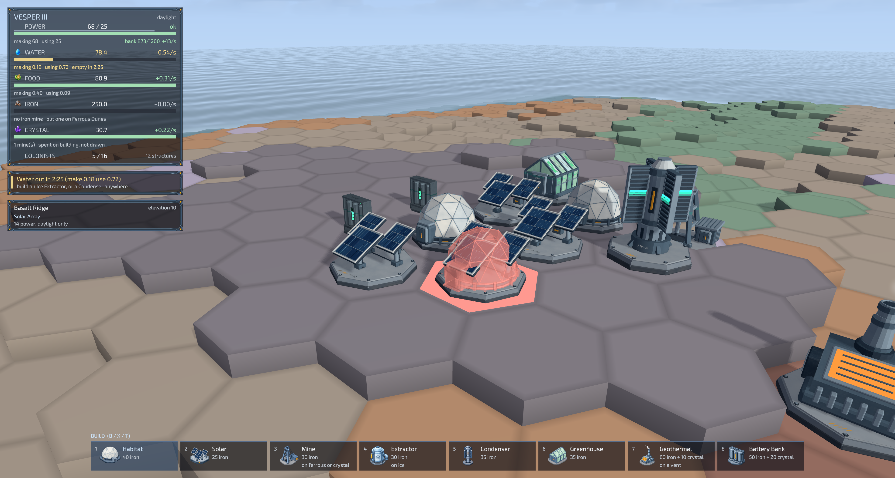
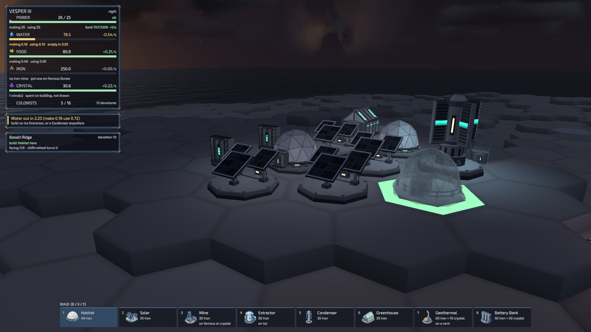
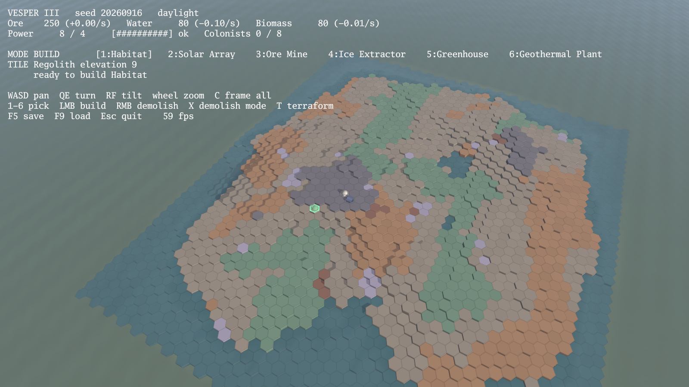
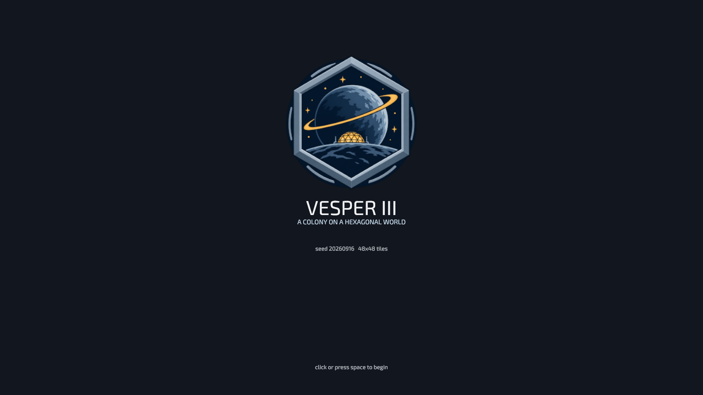

# Vesper III

**A showcase game for [glyphengine](https://github.com/derekmwright/glyphengine).**

A colony builder on a hex grid, in true 3D, on a planet that is not Earth.

The camera looks down on the world the way a strategy game does, but what is
under it is real geometry: hexagonal columns with cliff faces, cast shadows, a
day/night cycle that decides whether the solar arrays are producing, and a
methane sea with waves in it.

## What this is for

glyphengine is a Go game engine on Vulkan. This is the first complete game
built on it from outside, and it exists to answer two questions that an
engine's own examples cannot:

**What does the engine look like in the hands of someone who did not write it?**
Every example in an engine repository is written by the person who knows which
call to reach for. This one was not. Where the engine is good, that shows up
here as code that is short and obvious. Where it is not, it shows up as a
workaround with a comment explaining what was in the way — and usually an issue
number beside it.

**What does a whole game need that a demo does not?** A rotating cube needs a
mesh and a matrix. A game needs a save format, an interface that stays readable
at four different window sizes, art that survives a re-export, a build that
someone else can run, and a way to reproduce a screenshot six weeks later. Most
of the interesting decisions in this repository are about those, not about
Vulkan.

It is a real game, not a technology demo. It is played rather than watched, the
economy closes, and the parts you would expect to be faked are not.

### If you are reading this to learn the engine

The code is commented for that. Comments here explain *why*, not what, and the
ones worth finding are the ones that start with a mistake — the winding
convention derived from the engine's own `CreatePlane` rather than reasoned
about, the mesh capacity that silently truncates, the sRGB conversion that was
right until the engine fixed the thing it was compensating for.

Suggested reading order:

| | |
|---|---|
| `internal/hex` | no engine dependency at all. Start here to see the shape of the project. |
| `internal/world`, `internal/colony` | the simulation. Also no engine dependency, and tested without a GPU. |
| `internal/meshgen` | geometry to `renderer.Vertex`. Where the engine's conventions start to matter. |
| `internal/game/game.go` | the frame loop, and the only type that knows an `Engine` exists. |
| `internal/game/events.go` | every subscription in the project, in one function. |
| `internal/game/hud.go` | the interface toolkit, and the sRGB story. |

`docs/` has the captures. Every one was taken by the game itself with
`-screenshot`, and the flags to re-take it are in the caption.



*A colony in the afternoon. The red dome is the placement preview refusing an
occupied tile — it is the real habitat mesh with its material stripped, not a
stand-in. The panel reads left to right as stock against capacity, then rate; the strip
under it names the building that fixes the problem rather than restating the
number.*



*The same colony after sunset. The lights are not decoration — lamp brightness
is the power grid's satisfaction, so a colony that cannot cover its own demand
after dark goes dark. The battery banks show their charge on four strips and
their state on the lamp above them; the greenhouse's grow lights are on because
it has the power to run them.*



*The whole continent. Every tile is real geometry with cliff faces and cast
shadows, chunked 8x8 into one draw call each.*



*All four were captured by the game itself with `-screenshot`. `-camdist`,
`-campitch`, `-camyaw`, `-cursorx`, `-cursory` and `-timeofday` pin the camera,
the pick ray and the clock, so a capture can be re-taken exactly instead of
depending on where the mouse happened to be and what time the run reached.
`-demo` puts the colony there. The exact commands are in the Taskfile under
`task shot`.*

## Running it

```
task run                        # a new planet from a random seed
task run -- -seed 20260916      # the same planet every time
task run -- -cols 64 -rows 64   # a bigger continent
task run -- -demo               # a sample colony already standing, for screenshots

task            # everything there is to run, listed
task check      # formatting, vet, tests, and the art contract
task dist       # one executable you can hand to someone
```

Plain `go run .` works too; the [Taskfile](Taskfile.yml) is a collection of the
commands this was actually built with rather than a layer over them.

**To build:** Go 1.26+ and CGo with a C compiler, because GLFW and the Vulkan
wrapper are cgo. **To run:** a GPU and driver with Vulkan 1.1.

Windows and Linux are built and tested. macOS has everything it needs on the
engine side — the portability opt-ins
([#20](https://github.com/derekmwright/glyphengine/issues/20)), a real message
when no Vulkan driver is present
([#23](https://github.com/derekmwright/glyphengine/issues/23)), and mouse
coordinates that agree with the framebuffer
([#24](https://github.com/derekmwright/glyphengine/issues/24)) — but nobody has
run it on a Mac yet. `task dist:macos` builds the `.app` and bundles MoltenVK.
Reports welcome.

The engine is pinned to a commit in `go.mod` rather than a tag, because it is
v0.x and says outright that it breaks APIs without notice. Bumping it is a
deliberate act here, not a `go get -u`: the commit history records which engine
change each bump was for and what it required on this side.

### Distributing it

`task dist` produces one executable with every asset embedded — no folder
beside it, nothing to install or unpack — plus the controls and the font
licence:

```
dist/vesper.exe        16 MB
dist/README.md
dist/LICENSE-Exo2.txt
```

16 MB rather than 72: the models are authored with 2048x2048 maps and baked
down to 512 by `cmd/texscale` before they are embedded. See
[the bake](#the-bake).

## Controls

| | |
|---|---|
| `WASD` / arrows | pan (hold `Shift` to move faster) |
| `Q` `E` | turn |
| `R` `F` | tilt |
| wheel | zoom |
| right-drag, middle-drag | orbit (the drag moves the world, not the camera) |
| `C` | frame the whole continent |
| `1`–`8` | pick a structure |
| left click | build |
| `Shift` + wheel | turn the structure about to be placed |
| `Shift` + right click | demolish, with a confirmation |
| `X` | demolish mode |
| `T` | terraform mode — left click raises, right click lowers |
| `F5` / `F9` | save and load |
| `F3` | raw numbers over the panel (includes the lamp level) |
| `[` `]` | interface scale |
| `Esc` | the menu: save, load, back to the title |

## The game

You land with a habitat and a solar array already on the ground. Colonists
start arriving to fill the habitat, and they eat, which is the first problem.

| Structure | Cost | Needs | Does |
|---|---|---|---|
| Habitat | 20 iron | solid ground | houses 4; stores their food and water; draws power. **Employs nobody** |
| Solar Array | 25 iron | solid ground | 14 power, **daylight only** |
| Mine | 30 iron | ferrous dunes or a crystal flat | **iron or crystal, decided by the ground**; stockpiles it; draws power and water. **3 staff** |
| Battery Bank | 50 iron + 20 crystal | anywhere | stores 1500 power-seconds |
| Ice Extractor | 30 iron | an ice sheet | water, quickly. **2 staff** |
| Atmospheric Condenser | 35 iron | anywhere | water, slowly and at a price in power. **1 staff** |
| Greenhouse | 35 iron | solid ground; **lichen yields 1.5x** | food from water and power; stores some. **2 staff** |
| Geothermal Plant | 60 iron + 10 crystal | a thermal vent | 26 power day and night, **for water**. **3 staff** |

### Two ores, one building

A mine is the same building everywhere; what it brings up is the ground's
business. On **ferrous dunes** it cuts iron, which everything is built out of.
On a **crystal flat** it cuts crystal at 0.4 the rate, and crystal is what the
things that hold or convert energy are priced in — battery banks and geothermal
plants, and nothing else. On regolith or basalt it cannot be built at all.

Basalt used to yield ore, and better ore than the dunes. That made it the
obvious place for a mine and, being the most common high ground on the map, the
obvious place for everything else too — so siting a mine was never a decision.
Crystal flats are about 2-4% of land and every generated map has at least one,
which a test in `internal/world` pins: crystal has no second source, so a map
without one is a colony that can never store energy.

### Everything that is made is used

Every output has a consumer and every input has a source, which was not true
before: greenhouses grew biomass nothing ate, and habitats drank water and
nothing else.

```
             power ──┬─▶ mine ──┬─▶ iron ──▶ everything
                     │          └─▶ crystal ──▶ batteries, geothermal
                     ├─▶ extractor / condenser ──▶ water
                     └─▶ greenhouse ──▶ food ──▶ habitat ──▶ colonists
water ──┬─▶ mine
        ├─▶ greenhouse
        ├─▶ habitat
        └─▶ geothermal ──▶ power
```

That last edge is the interesting one. A geothermal plant is a steam cycle and
the cycle leaks, so night power is no longer unconditional: it is bought with
water, and a colony that solves darkness has to have solved water first.

### The resolution order is the design

Geothermal output depends on water, and water production depends on power,
which would be circular if the tick resolved them in one pass. It does not. It
resolves in five steps and each one reads only numbers the ones above it have
already settled:

1. **Coolant.** Power plants draw their makeup water straight off the tank,
   before anything else, because the grid cannot be resolved until their output
   is known. Nothing else can come first without making the resolution
   circular.
2. **The grid.** Supply against demand, the battery bank covering the gap, and
   whatever is still short becomes the brownout that scales everything below.
3. **Water.** What the rest of the colony draws, scaled by the grid — a mine
   that is not turning is not pumping either — and clamped to the tank.
4. **Production.** Ore and food, scaled by both power and water; water out into
   the tank.
5. **Food.** Habitats feed the colonists living in them, scaled by occupancy so
   a habitat raised ahead of the people who will fill it does not eat on their
   behalf. It is the one draw the grid does not scale: people eat in a
   blackout.

Water and food produced in a tick land in the store for the next one. At a
tenth of a second that is a lag nobody can see, and it is what keeps step 1
from having to know what step 4 will do.

Power is the binding constraint and it is not pass/fail: a colony that
generates less than it draws runs *everything* at the ratio between the two, so
a brownout slows the mines rather than stopping them. Solar stops dead at
night, which is what the geothermal plant is for — and vents are rare, so where
they are shapes where the colony goes.

Solar is free power that stops at sunset, and a **Battery Bank** is what makes
it a whole answer rather than half of one: surplus charges the bank by day, the
bank covers the draw after dark. The grid resolves in that order — generation
first, then storage covering whatever generation missed, and only what is still
short becomes a brownout.

That is the same shape as the water problem, deliberately. A geothermal plant
is cheap and needs a vent; batteries cost more and can be built anywhere —
exactly as an ice extractor is better than a condenser but needs ice. A player
who learned the trade once should recognise it.

One consequence worth knowing: because discharge is limited by what is stored
rather than by a rate, a bank with anything in it covers the *whole* shortfall.
So there is no "partly charged but still short" state — after dark a colony is
either running fine, or its bank is flat. A test pins that, because it is why
the power advice has two night branches and not three.

Water is the first thing that goes wrong. Habitats drink, greenhouses drink
more, and ice is about one tile in eighty and sits at altitude — so the
condenser exists as the worse-but-available answer when you did not land near
any. It is deliberately beaten by the extractor on every axis, so ice stays
worth walking to.

## Pointing and clicking

Right-drag orbits the camera and right-click demolishes, which is a conflict:
the same button does both. They are told apart by whether the pointer moved —
a release within five pixels of the press is a click, anything further was an
orbit. The slop matters. At zero, a hand releasing a button moves enough to
swallow about half of all intended clicks, and the player concludes demolish is
unreliable rather than that their mouse wobbled. `camera_test.go` pins it.

Demolition also asks first, because it is the only irreversible action in the
game and the only one a stray drag can trigger. The prompt says what comes back
and what it cost, and takes Enter or Escape as readily as the mouse.

Escape is deliberately **not** handed to the engine as `WithQuitKey`. The
engine's binding fires before the game sees the key, so cancelling a
confirmation would have quit instead. The game handles it, where it can see
what is open: the confirmation takes it first, then the pause menu, and only
the Exit item in that menu actually closes the window. Escape used to quit
outright, which is a thing you do to a player exactly once.

`Shift` and the wheel turn the structure about to be placed, a sixth of a turn
at a time — the grid's own symmetry, so it always sits square on its hexagon.
The heading is stored with the building and comes back on reload.

This replaced a per-tile hash that rotated each structure to one of the same six
orientations automatically, to stop a row of habitats looking stamped. That read
as a colony nobody surveyed, because the structures are not hex-symmetric.
Variety was worth having; deciding it for the player was not.

The scroll wheel does two jobs, and the one that does not happen is as
deliberate as the one that does: `handleKeys` consumes the scroll before
`Camera.Update` runs, so a shift-wheel notch turns the building **instead of**
zooming. Both read the same one-shot value, so whichever asks first gets it —
the call order in `Game.Update` is the entire mechanism.

## Lights at dusk

As the sun goes down a warm point light appears at every structure and the
structure's own amber accent starts to glow — the light is what falls on the
ground around it, the glow is what makes the building read as occupied rather
than as a shape with a lamp beside it. The accent that lights up is chosen by
colour rather than by index, so a remodelled structure keeps working as long as
it keeps one warm part.

Both are scaled by the same number, and **that number includes the power
grid**:

```
lamps = dusk(sunElevation) * powerSatisfaction
```

Satisfaction counts the battery bank, which is the point: a solar colony after
dark generates nothing at all and stays lit because it bought storage. An
earlier version tested power *supply* here and blacked out precisely the colony
that had solved the problem — the test suite carries that case now.

Either factor at zero means darkness. A blackout at noon costs nothing visible
because the lamps were not on anyway; a blackout at midnight puts the colony
out. A brownout dims it by exactly the fraction the grid is short, because that
is what satisfaction already means everywhere else.

Which makes the solar-versus-geothermal lesson something you can see on the map
instead of only reading in the panel: build nothing but solar arrays and night
falls on a colony that goes completely dark. Both cases are pinned by tests,
since the coupling is a rule rather than an effect.

Lamps are deliberately dim — 0.16 of the magnitude the engine's lighting
example uses. They accumulate, being unshadowed and additive, and at example
strength a dozen structures blew the ground out to flat white and turned the
buildings into silhouettes against it. One lamp should light its own tile and
tint its neighbours, and the sum of a colony should still be night. The engine
takes at most 32 point lights and truncates the rest, so the nearest to the
camera are the ones kept.

`-timeofday` and `-daylen` exist for looking at this: `-timeofday 0.8 -daylen -1`
freezes the clock just after sunset, which is the only way to capture a
particular hour twice.

## Reading the panel

The readout is built around the fact that a net rate cannot tell you what to
do. "Water -0.10/s" is the same number whether one extractor is losing to three
habitats or no extractor is losing to one, and those need opposite fixes, so
every resource shows both halves:

```
WATER            79.8            -0.10/s
[############------------------------]
making 0.45   using 0.55   empty in 13:18
```

Every bar is how full the store is. That is the only thing a bar can honestly
be, and it took two wrong answers to get there.

- **Power** is the exception: it has no stock, so its bar is supply against
  demand. The battery bank gets its own figure on the line below.
- **Water, food, iron and crystal** are drawn against a ceiling. A full bar is
  amber rather than green, because full is the one state where the thing to do
  is not "make more".

### Everything has a ceiling, and that is a game rule before it is a bar

An uncapped economy pays a player for leaving the game running. Walk away for
ten minutes, come back to enough iron that the next hour of decisions has
already been made for you. A ceiling means time alone earns nothing — what
earns is building somewhere to put it, which is a decision, which is the game.

Capacity comes from the buildings you already place. A habitat carries the
larder and the tank for the eight people in it; a mine keeps a stockpile at the
pithead; a battery bank holds power as it always did. So storage is not a
separate thing to remember, it is a reason the same expansion pays twice — and
`internal/colony` reports what is going over the side:

```
IRON          400 / 400          +0.55/s
[####################################]
3 mine(s)   full, losing 0.55/s
```

The rate still reads healthy because the mine really is still running. It is
being thrown away, which is a different problem from a stopped mine and wants a
different fix, so it gets its own line rather than a number that merely looks
smaller.

Bars were production-against-consumption once, which drew a quarter-full red
bar next to an obviously healthy food figure. Then they were a *runway* — how
long until empty against a ten-minute horizon — which was true and still not
what anyone reads a bar as. Neither was wrong about what it measured. Both were
answering a question nobody asks of a bar. The fix was not a better bar, it was
giving the thing a maximum.

### Colonists are a resource too

Every structure declares how many people it takes to run. Total jobs against
total colonists gives one ratio that scales production, exactly as power
satisfaction and the water ratio already do:

```go
works := sat * waterRatio * r.Staffing
```

That closes a loop that was open. A habitat used to be a cost centre — it
housed people who drank, ate and did nothing, so the only reason to build one
was that the game kept offering more colonists. Now a mine wants three staff, a
greenhouse two, a geothermal plant three; staff want somewhere to live; housing
wants food; food wants a greenhouse; the greenhouse wants staff.

Solar arrays and battery banks employ nobody, deliberately. A panel that needs
someone standing next to it is not a solar panel.

### And they leave if you stop looking after them

Thirst used to do nothing. A colony could run its tank dry and lose nobody,
because water reached the colonists only as an input to the greenhouse that fed
them — so losing water was punished by a slow starvation two steps downstream,
and a colony with a full larder and an empty tank was fine indefinitely.

Life support is water *and* food now, it is exempt from the grid the way food
always was (a blackout does not stop anyone being thirsty), and leaving is
proportional to the shortfall rather than a flat rate past a threshold. A colony
two percent short should lose someone eventually, not at the same speed as one
with an empty larder — and the old cliff at 0.999 meant a rounding error could
empty a colony as fast as a famine could.

The advisory names which half is missing, because the fix for one is not the fix
for the other:

```
Colonists leaving - no water
build an Ice Extractor, or a Condenser anywhere
```

The other half of that fix was arithmetic. A colony making 0.19 water a second
and drinking 0.19 a second does not come out at exactly zero in floating point,
and `stock / -net` on a residue of 1e-17 produced

```
making 0.19   using 0.19   empty in 31224955555h16m
```

which was true and useless. `colony.RateEpsilon` is the smallest net rate
treated as movement — a third of a unit an hour, well under anything in the
catalog — so a balanced ledger now reads as flat. `Duration` caps at `>99h` as a
backstop, and a property test drives three hundred random colonies through
sixty thousand ticks asserting that no countdown, ratio or stock ever leaves the
range a person could read.

Below that is the advisory strip, which is the part that answers the question
rather than reporting a measurement:

```
BLACKOUT - 28% power, output reduced
build 3 more Solar Array(s), or a Geothermal
```

It names the building, and it counts: the number comes from the actual
shortfall divided by what a solar array is producing *at the current time of
day*, so at night it recommends geothermal instead of advice that does nothing
until morning. Advisories only appear when something needs attention — a stock
with an hour of buffer is reported in the panel and stays out of the strip, so
the strip does not become noise to scroll past.

Terraforming costs iron per step, will not dig under a standing structure, and
will not cut below the waterline.

## How it is put together

```
internal/hex       flat-top axial coordinates, layout, neighbours, rounding
internal/world     terrain, tiles, the map, procedural generation
internal/colony    what can be built, where, and the economy that results
internal/meshgen   hex chunks and structure geometry -> renderer vertices
internal/event     a small synchronous publish/subscribe bus
internal/game      the only package that knows an Engine exists
```

That split is the engine's own rule 8 applied to a game: `hex`, `world`,
`colony`, `event` and most of `meshgen` import no engine code and are tested
without a GPU. Game components live in the game's own structs on the engine's
`ecs.World` rather than being added to `Scene.C`.

Inside `internal/game`, one file per duty:

```
game.go          Game, Config, the frame loop
events.go        the event vocabulary and every subscription, in one place
scene.go         the GPU's copy of the world: meshes and entities
terrain.go       chunk meshes, the cursor, the placement ghost
actions.go       input -> intent -> the colony
camera.go        the RTS camera
pick.go          screen ray -> tile, without a physics engine
lights.go        the colony going dark, and lighting itself
activity.go      what a structure looks like while it is working
hud.go           the widget toolkit: text, quads, panels, bars
hud_frame.go     what gets drawn each frame, and what is dropped when it will not fit
panel_colony.go  the resource readout, advisories and tile inspector
hotbar.go        the build bar
tooltip.go       the hovered structure's card
confirm.go       the one modal: demolition
splash.go        the title card
save.go          serialisation
```

### Game holds five things, not thirty

`Game` sits where the world, the renderer, the lights, the interface and the
player's intent all meet, which is exactly the type that grows into a pile of
loose fields nobody can read. It holds each of those as a named group instead:

```go
type Game struct {
    cfg    Config
    Map    *world.Map      // the truth
    Colony *colony.Colony  // the truth
    cam    *Camera
    bus    *event.Bus
    scene  scene           // what the renderer has been told
    lights lighting        // the dusk pass
    intent intent          // what the player is about to do
    ui     uiState         // what the interface itself is doing
    hud    *hud
    splash splash
    ...
}
```

Each group is declared in the file that drives it, so `g.intent.facing` can be
found by looking where facing is changed. The test for whether a field is in the
right group is what changes it: `intent` is written by the keyboard and the
world pick, `ui` by the layout, `scene` by placement and demolition.

### Events for things that happen, polling for things that are true

`internal/event` is a synchronous, type-keyed bus: `event.On(bus, func(ev T))`
to subscribe, `event.Emit(bus, ev)` to publish. Delivery is in registration
order, on the caller's goroutine, and complete before `Emit` returns — a game
loop wants that, and an async bus would mean an event raised on the frame a
building went up might be handled on the next one.

What it is for is the discipline, not the plumbing:

- **"A structure was placed" is an event.** It happens at an instant, it is
  gone once handled, and nobody can ask about it later.
- **"The colony has 250 iron" is state.** It is true continuously, anyone can
  read it whenever they like, and publishing it would create a second copy that
  can disagree with the first.

So the resource panel subscribes to *nothing*. It reads `Colony.Readout` every
frame and draws what it finds. Routing that through a bus would buy nothing and
add a cache to invalidate.

Placement is where the bus earns its keep. It used to read: place it in the
colony, spawn its entities, write a status line — three unrelated concerns in
one function, in an order nobody could derive from the rules, and a path that
forgot the middle one left a building that existed and was never drawn. Now:

```go
func (g *Game) place(_ *glyph.Engine, a hex.Axial) {
    k, facing := g.intent.selected, g.intent.facing
    if err := g.Colony.PlaceFacing(g.Map, k, a, facing); err != nil {
        emit(g, ActionRefused{Err: err})
        return
    }
    emit(g, StructurePlaced{Kind: k, At: a, Facing: facing})
}
```

The colony is the authority on whether the structure exists. Once it says so,
this publishes the fact and stops. Drawing it and announcing it are two other
systems' business, and both are registered in `subscribe` — which is the one
function to read to find out what reacts to what.

One deliberate non-use: **loading a save does not publish placements.** Nothing
was built and nothing was paid for, so announcing forty structures going up
would be false. The load rebuilds the scene directly and reports itself. An
event is a fact about something that happened, and restoring a saved world is
the world being replaced.

A few decisions worth knowing about if you change something:

**The grid is flat-top axial, and corner order is load-bearing.** The edge
between corner *i* and corner *i+1* is the edge shared with neighbour *i*, which
is what lets the cliff mesher walk corners and neighbours with one index. A test
pins it. Using the pointy-top corner phase on this grid silently shears every
cliff half a tile off its edge.

**Winding is derived from the engine, not reasoned about.** The renderer culls
with `FrontFace: Clockwise` under a Y-flipped projection, so the rule every face
follows is *the triangle's cross product points opposite its surface normal* —
taken from the engine's own `CreatePlane`. Getting it backwards does not glitch
or warn, it makes geometry vanish. `TestEveryTriangleWindsAgainstItsNormal`
recomputes it for every triangle of a real map, and `Builder.Tri` flips the
winding for you so the structure definitions never have to think about it.

**Terrain is chunked and dynamic.** 8×8 tiles per chunk, one draw call each,
uploaded through `CreateDynamicIndexedMesh` so terraforming rewrites a chunk in
place instead of churning a GPU allocation per keypress. `UpdateMeshData`
silently *truncates* past the capacity it was created with, so
`meshgen.ChunkCapacity` sizes the buffer and two tests hold the mesher to it —
one for the worst-case chunk, one that measures what a single fully walled tile
actually costs, because the first can never reach the bound.

**Picking does not use the physics engine.** Giving 2,304 tiles a collider
apiece to answer one query per frame would be a lot of machinery for a question
the map can answer directly, so `game.Pick` marches the screen ray and bisects
the crossing. A ray that hits a cliff face returns the tile on top of it.

**The ledger is float64.** Rendering is float32 because the GPU is; the economy
is not, because at a five-figure stockpile float32 quietly stops counting small
per-tick increments.

**The placement ghost is the real structure with its material stripped off.**
The lit shader multiplies vertex colour by the per-entity tint, and a modelled
structure carries its material colour on that same tint — so a ghost is the
structure's own meshes with the texture and material dropped, drawn translucent
under a green or red `Color`. One mesh serves both states. It used to be a crude
procedural stand-in (a dome was a hemisphere, a mine was a box), which said
where a building would go but nothing about what would be going there.

A glTF exporter splits a mesh by material, so a structure arrives as several
primitives. They are concatenated into a single mesh at load — same vertices,
same winding, indices rebased as each is appended — so the preview is one
entity and one draw with a single consistent alpha.

It was one translucent entity *per primitive* until
[glyphengine#19](https://github.com/derekmwright/glyphengine/issues/19), because
`LoadGLTF` returned GPU handles and discarded the geometry it had just decoded,
leaving nothing to merge on the CPU side. That cost a draw per primitive and,
worse, made a structure blend against itself: where two of its own parts
overlapped the preview went denser. That was rationalised at the time as reading
like a hologram. It read like a bug, and it was one.

Anything with no model still falls back to `meshgen.Ghost`, which builds the
procedural shapes in flat white — the procedural meshes paint themselves in
vertex data, so those genuinely cannot be tinted.

## What this fed back into the engine

This is the part that makes it a showcase rather than a sample. Building a
whole game on a young engine finds things, and every one of them was filed with
the measurement that found it rather than as an opinion.

**Fixed upstream, and in use here:**

| | |
|---|---|
| [#3](https://github.com/derekmwright/glyphengine/issues/3) | no generic mesh instancing |
| [#4](https://github.com/derekmwright/glyphengine/issues/4) | no `ShaderSet` passthrough on `glyph.New` |
| [#5](https://github.com/derekmwright/glyphengine/issues/5) | no blended pass, so a placement preview had to be an opaque full-bright solid. The ghost is a real translucent object now. |
| [#6](https://github.com/derekmwright/glyphengine/issues/6) | overlays were composited into the HDR scene target *before* the water, bloom and tonemap passes, so water refracted the HUD and erased most of it. Found by looking at a wide shot of this map and wondering why the text was wavy. |
| [#13](https://github.com/derekmwright/glyphengine/issues/13) | overlay colours were linear while documented as sRGB, so a HUD backdrop written as 0.05 arrived at 0.24. See the note above the palette in `hud.go` — the fix required deleting this game's compensating helper *in the same commit* as the engine bump, or the conversion applies twice. |
| [#14](https://github.com/derekmwright/glyphengine/issues/14) | panel mode hardcoded its interior fill, so a game could not choose its own panel colour |
| [#20](https://github.com/derekmwright/glyphengine/issues/20) | macOS: the instance and device missed the two portability opt-ins MoltenVK requires. Without them `vkEnumeratePhysicalDevices` returns zero devices on a Mac and it surfaces as "no GPU found" on a machine with a perfectly good one. |
| [#19](https://github.com/derekmwright/glyphengine/issues/19) | `LoadGLTF` discarded the geometry it had just decoded, so a model could only ever be a draw call. The placement ghost had to be one translucent entity per primitive, which cost a draw each and made a structure blend against *itself*. It is one merged mesh now. |
| [#21](https://github.com/derekmwright/glyphengine/issues/21) | `ModelMesh` dropped the glTF material name, leaving base colour as the only way to identify a primitive — matched with a float tolerance that was invisible in the art, not greppable, and silent when it broke. `internal/artcheck` matches names now. |
| [#23](https://github.com/derekmwright/glyphengine/issues/23) | a machine with no Vulkan driver got a null proc address rather than a message saying so. That is the default state of every Mac. |
| [#24](https://github.com/derekmwright/glyphengine/issues/24) | `MousePos` was in screen points while `ScreenRay` divided by framebuffer pixels. They agree on a 1:1 display and are out by 2x on a Retina one — or on Windows at 200% scaling, which is where it was actually observed. |

**Open, and why they matter here:**

| | |
|---|---|
| [#12](https://github.com/derekmwright/glyphengine/issues/12) | the sky palette is baked into `atmosphere.inc`, which `applyFog` shares. Changing it through `WithShaders` means vendoring 430 lines of engine lighting into this repo to edit six constants. This is why the sky over an alien planet is still Earth's. |

Instancing is deliberately **not** adopted. A colony reaches a few dozen
structures in normal play, so batching would save a few dozen draw calls
against a frame already comfortably inside budget — and the issue asking for it
says to measure before building on it, which applies just as much to using it.
Worth revisiting if colonies get into the thousands.

### On filing engine issues from a game

Every issue above says what was measured, on what, and what it cost. Two of
them include a correction the engine author made to my diagnosis after
measuring — one where I predicted a Windows no-op and was wrong — and that is
the point rather than an embarrassment. An issue that reports a number can be
argued with. An issue that reports a feeling cannot.

Three of them said plainly that the finding was read from source rather than
from a failing run, because there was no Mac to test on. Saying so is what makes
the others trustworthy — and one of those three, #24, turned out to reproduce on
Windows at 200% display scaling, which is how it got confirmed before a Mac was
ever involved.

The traffic goes both ways. The fix for #20 carries a correction to the report:
it predicted the portability extension would be absent on Windows so that
nothing would change there, and that is wrong — it is a *loader* extension and a
current Windows loader advertises it, so the flag is set there too. Harmless,
and measured rather than assumed. An issue that reports a number can be argued
with; an issue that reports a feeling cannot.

Instancing is deliberately **not** adopted yet. A colony reaches a few dozen
structures in normal play, so batching would save a few dozen draw calls
against a frame that is already comfortably inside budget — and the issue
asking for it says to measure with `task bench` before building on it, which
applies just as much to using it. Worth revisiting if colonies get into the
thousands.

## Art and typography

```
assets/icons.png       the structure icon atlas the hotbar samples
assets/icons-src/      the icons as separate files, for regenerating the atlas
assets/panel.png       the nine-slice bezel behind every panel
assets/logo.png        the title card badge
assets/fonts/Exo2.ttf  the interface typeface
cmd/iconatlas          packs icons-src into icons.png
cmd/trimart            crops generated art to its opaque content and resizes it
```

`cmd/trimart` exists because generated art arrives with the subject floating in
a transparent margin. That is harmless for an icon and wrong for a nine-slice:
the slice takes its corner regions from the image corners, so a frame that
stops short of the edge gets corners made of empty space and edges that stretch
the margin along with the bezel. It also reports the border thickness at each
edge midpoint, which is what `frameInset` has to be set from.

The panel bezel is drawn in the UI pipeline's *texture* mode, not its panel
mode, even though it is a nine-slice. Panel mode paints every transparent texel
as `tint * 0.2` at 70% alpha, and a frame quad is mostly transparent — the
artwork band is about a third of the corner region — so it drew a light grey
ring all the way around the inside of every panel, between the metal and the
interior (measured `#656768` against a `#2E363C` interior). Texture mode
multiplies by the texel, so transparent texels contribute nothing and only the
frame is drawn; the fill comes from a backing quad this code controls, which is
what makes the backdrop a colour rather than a fixed wash.

The backing runs the **full** panel rectangle, under the bezel rather than
inset inside it. Inset by even a couple of units it left a strip along every
edge covered by neither the backing nor the artwork — the bezel carries a small
transparent margin of its own — and the map through that strip read as a second
grey border.

Both are optional at runtime: a missing bezel falls back to the flat panels the
layout was built against, and a missing logo leaves a type-only title card.

The icons were generated with an image model and packed by `cmd/iconatlas`
into a single 512x384 texture, because the whole interface is otherwise one
draw call and a second texture would mean a second. Two sets share it: the
first eight cells are the hotbar in `colony.Buildable` order, and the last four
are the resources the status panel labels its rows with.

The cell a source lands in is the number on the front of its filename, so the
ordering is visible in a directory listing:

```
01-habitat.png .. 08-battery.png   the hotbar
09-water.png .. 12-food.png        the resource rows
```

Those numbers are read as numbers, not sorted as text. Sorting by name worked
while there were eight sources and would have quietly put `10-` before `2-` on
the ninth — the kind of break that shows up as a wrong picture rather than as
an error. Two files claiming one cell is refused outright, because one would
overwrite the other and the atlas would still look plausible.

A test checks the atlas divides into the grid the UV maths assumes and that
there is art for every cell the HUD refers to. Both matter: regenerating with a
different `-cols` would leave every slot showing the right name against the
wrong picture, and adding a structure without adding an icon would push the
resource cells along by one.

To change an icon, replace the file in `assets/icons-src` and re-run:

```
go run ./cmd/iconatlas -src assets/icons-src -out assets/icons.png
```

Icons are optional at runtime. A build whose atlas fails to load logs it and
falls back to text-only slots rather than refusing to start.

## Texturing the hexagons

```
assets/terrain-src/*.png    four greyscale detail patterns, 480x480
assets/terrain-detail.png   the atlas the game embeds
```

The tiles are flat-shaded colour, and the colour is the biome. The detail atlas
adds surface without touching that, because the lit shader multiplies:

```glsl
vec3 baseColor = fragColor * texSample.rgb;
```

So every texel is a **multiplier**, and white means "leave this tile the colour
it already is". The patterns sit between 0.86 and 1.0 — which is what "lightly
textured" turns out to mean in numbers. A coloured pattern here would give
colour times colour: muddy, and darker than either. `cmd/terrainatlas` refuses
a source that is too dark to be a multiplier.

Which pattern a tile gets is **not** decided by its terrain. It is a hash of
the tile's position into one of four patterns and one of six rotations, so
neighbouring tiles of the same biome do not repeat. Six rotations because those
are the ones that map a hexagon onto itself; any other angle would show as a
pattern sitting crooked on its tile. The hash is stable, so terraforming a tile
or reloading a save does not reshuffle the map's own texture.

Walls and submerged caps sample a white corner deliberately — detail belongs on
the surfaces the light falls on, and a cliff face that took it would read as
dirt.

### The gutter

A cell is 512 pixels holding a 480-pixel pattern, leaving a 16-pixel white
margin. That margin is the whole reason the atlas works: at mip levels above
zero a sample near a cell edge averages in whatever is beyond it, and without
the margin that is the neighbouring pattern. It shows up as a faint seam around
every hexagon — visible only at distance, which is exactly where this camera
sits.

It is also the easiest thing in the project to destroy by accident. Rebaking
with a packer that scales each source *to fill* its cell produces a file that
is the right size, loads perfectly, and is wrong. `TestEveryCellKeepsItsWhiteGutter`
measures the bounding box of everything that is not white and fails if it
reaches into the margin.

That test had to be written twice. The first version probed the margin for
white and passed on a deliberately broken atlas — these patterns are round
blobs that fade to white at their own edges, so a stretched cell *still* reads
white in its corners. Probing could not tell. The extent is the thing that
actually has to fit.

```
task terrain      # repack and check
```

## Structure models

```
assets/models-src/*.glb  the authored models, as they come out of the DCC tool
assets/models/*.glb      what the game embeds: the same models, textures baked down
```

Structures are loaded from glTF when a model exists for them and fall back to
the procedural geometry in `internal/meshgen` when it does not, so the set can
be replaced one at a time rather than all at once — and a build with no
`assets/models` at all still runs.

A model's footprint radius has to stay under 0.80 metres. A hexagon of
circumradius 1 has an inradius of 0.87, so a model at 1:1 reaches almost to its
own tile edge and a row of them reads as one continuous mass; `modelScale`
brings them to about where the procedural shapes sit, which is what makes the
modelled and procedural sets look like one game.

A glTF exporter splits a mesh by material, so a three-material building arrives
as three primitives. Those become three entities sharing one transform, which
is why `buildingEnt` maps a tile to a *slice*.

### The bake

Models are authored with 2048x2048 base-colour and surface maps. That is the
right thing to keep — a source that has been thrown away cannot be re-cut, and
the next screen is always bigger — and the wrong thing to ship. A structure
covers about a hundred pixels at the camera distance this game is played at, so
eight pairs of 2048 maps were spending 55 MB to describe detail nobody sees,
and took the release binary to 72 MB.

So `assets/models-src` is the source and `assets/models` is the bake:

```
task models:bake      # or: go run ./cmd/texscale -src assets/models-src -out assets/models -size 512
```

`cmd/texscale` rewrites the glTF with its textures capped, copying geometry
through untouched and preserving every field it does not understand — a glTF
carries extensions, and a rewrite that silently dropped one would be worse than
not rewriting at all. 55 MB of textures becomes 7.4 MB and the release binary
goes from 72 MB to 15 MB. At three times magnification the two are
indistinguishable.

### The art contract

Three structures are animated by *material*. The game finds the battery bank's
four charge strips and its status lamp, the condenser's fin band, and the
greenhouse's grow lights by **material name** — `Charge_Runtime_2`,
`CondenserPulse_Runtime`, `GrowLight_Runtime` — and drives that primitive's
emission from the simulation.

That makes the art load-bearing, and it fails *silently*. A model re-exported
with its indicator merged into the body loads perfectly and simply never lights
up.

```
task models:check     # or: go run ./cmd/modelcheck assets/models-src/*.glb
```

This is not a hypothetical failure. An earlier version of this project kept the
models under a set of procedural Blender scripts, and those scripts went stale:
they produced two materials where the shipped battery had six. Running them
regenerated all eight models, replaced every textured one with an untextured
one, and reported success. The models were recovered by scanning a stale binary
for glTF headers.

#### It used to be colours, and that is the more useful story

`renderer.ModelMesh` did not keep the material name, so appearance was the only
handle there was and a marker was a reserved base colour — `(0.015, 0.55, 0.85)`
meant the battery's second charge strip. Matched with a tolerance of 0.002,
because a colour makes a float32 round trip through the exporter and an exact
comparison fails on a file that is correct.

The tolerance was the whole problem:

- **Invisible in the art.** Nothing in a modelling tool says 0.55 is
  load-bearing. It looks like a colour someone picked.
- **Not greppable.** `Charge_Runtime_2` turns up in the model, the exporter and
  the game. `0.55` turns up everywhere.
- **One namespace.** Every driven part in the game needed a globally distinct
  colour, because the RGB cube was all there was.
- **Silent and late.** A re-export a thousandth off loaded fine and stopped
  lighting up weeks later.

The dusk lamp was worse: there was no reserved colour for it at all, just a
heuristic picking whichever part was warmest. It worked, and degraded in the
worst way available — a model with nothing warm in it never lit, and the symptom
was an unexplained dark patch in a colony at night.

[glyphengine#21](https://github.com/derekmwright/glyphengine/issues/21) was
filed with that as the evidence, and `ModelMesh` keeps the name now. The
matching is string equality; the tolerance is gone; `internal/artcheck` is
shorter than the version that replaced it.

`internal/artcheck` holds the names and the rule for reading them, in a package
with no engine dependency so a command-line tool can use it. The tests in
`internal/game/models_test.go` assert the shipped art through the game's own
matchers rather than restating the names, so renaming a marker renames the test
with it — and `task check` runs the lot.

The typeface is [Exo 2](https://fonts.google.com/specimen/Exo+2), bundled under
the SIL Open Font Licence — the licence travels with it in
`assets/fonts/OFL.txt`, and a test fails if it ever stops doing so. The MSDF
atlas is generated from the TTF at startup rather than shipped pre-baked, so it
cannot go stale against the font it came from. Exo 2 is proportional, so every
figure in the panel is right-aligned to a column edge: left-aligned, a number
moves its own last digit each time the value changes, which turns a readout
into a flicker.

## The front end

```
splash  ->  main menu  ->  playing  <->  paused
```

A main menu with New Colony, Load Colony and Exit; Escape during a game opens
the same widget with Resume, Save, Load and Exit to Menu. Both are one `menu`
type — a title and a column of choices, driven by the keyboard and the pointer
at the same time, sharing one highlight so the two can never disagree about
what Enter would take.

The widget holds no actions. `update` returns the id of what was chosen and
`session.go` decides what that means, which is what lets the whole thing be
tested without constructing an `Engine`.

### There is no scene swap, and there does not need to be one

Worth being explicit, because "main menu" usually implies loading a different
scene. glyphengine has no such concept: an `Engine` owns exactly one `*Scene`,
created once, and the `Game` interface it drives is `Init` plus `Update` for
the lifetime of the process. There is no `SetScene`, no scene stack, nothing to
unload.

So this is a state flag inside one scene:

- **One set of GPU resources for the whole process.** The font, the icon atlas,
  the structure meshes, the water surface and the chunk meshes are all built in
  `Init` and never rebuilt. None of them depend on which world is loaded.
- **`screen` gates input and simulation.** `Update` returns early when a menu
  is open, so the camera, the pick ray and the hotbar never see the frame;
  `FixedUpdate` returns early too, so a paused colony does not quietly drink its
  water while the player reads the menu.
- **The world is replaced in place.** `startWorld` regenerates the map, clears
  the building entities, re-uploads every chunk and refreshes the heightmap the
  water shades against. That is the same operation terraforming already does on
  one tile, at the scale of all of them.

Which is not a workaround. Chunk meshes are dynamic and sized for a fixed grid
precisely so they can be rewritten; tearing them down to build identical ones
would be work for its own sake. The one real constraint is that the grid is
fixed at startup — which is also why loading a save from a differently sized
world is refused outright rather than half-applied.

**But two parts of it were, and got filed.** The distinction is the whole job
of a pathfinder: "this game did not need scene management" is a conclusion
about this game, and the question that matters is whether the next adopter
hits a wall here.

- [#35](https://github.com/derekmwright/glyphengine/issues/35) — there is no
  way to pause the *engine's* simulation. `Scene.Tick` runs unconditionally,
  before `FixedUpdate`, so a game that returns early has stopped its own
  simulation and none of the engine's: physics, character controllers,
  interpolation, animation. This game is unaffected and filed it anyway,
  because it is unaffected by luck — its entire simulation happens to live in
  its own `FixedUpdate`. The first game on this engine with a rigid body and a
  pause menu finds a crate still sliding behind it, and nothing errors.
- [#36](https://github.com/derekmwright/glyphengine/issues/36) — `ui.UIManager`
  has no focus traversal. `Clickable` is mouse-only and `Focusable` exists for
  text entry, so there is no arrow-key or gamepad movement between widgets.
  Which is why the menus here are hand-rolled rather than built from `ui`: the
  one behaviour a main menu must have is the one the toolkit does not offer.

What was *not* filed matters too. The camera not being set on menu frames was
this game's bug, not the engine's — `Update` returned before `SetCamera` and
the engine had simply never been given a view. And "add scene management" is
not an issue, because nothing here needed it and a speculative request is worth
less than no request.

The main menu draws over a generated world with the camera framed on the whole
continent and turning slowly, about three minutes to the revolution. A still
image would be cheaper and would look like a photograph of the game instead of
the game. Leaving to the menu generates a *new* world rather than keeping the
abandoned one, so the backdrop is never the colony that was just given up on.

### The buttons came with a contract

The menu rows are nine-slice artwork — four states in `assets/ui/buttons`, and
the set arrived with `buttons.json` and `validation.json` beside it: size,
inset, minimum drawn size, per-state label colours, the order states resolve
in, and a sha256 for each PNG.

That is worth more than the pictures. `button_test.go` checks the *code*
against that manifest rather than against numbers copied out of it — the
constants in `button.go`, the state priority, which file each state loads, that
all four share a silhouette so a state change recolours a button instead of
moving it, and that the art still hashes to what was recorded. Art and code
cannot drift apart quietly, which is the same problem `internal/artcheck`
solves for the structure models and the same problem the terrain atlas's gutter
test solves.

One number in it is load-bearing: the inset is 24 on all four sides of a
96-tall source, so a button drawn shorter than 48 units has its top and bottom
corner regions overlapping and the metal folds in on itself. The documented
minimum is 56. The menu's rows were 46 when they were plain rectangles, and a
test now fails if any button in the game drops below the floor.

The README that shipped with the art also asked for texture mode with a white
tint rather than panel mode, "to retain the artwork rather than a panel shader
that replaces the center fill" — which is the same fight documented over the
bezel in `hud.go`, arrived at independently by someone drawing the art.

The resource panel is hidden on the main menu and kept on the pause menu. On
the main menu it would be furniture from a game nobody is playing — 0 of 0
colonists, an advisory telling nobody to build a habitat. On the pause menu the
numbers are real, and checking them is half the reason to pause.

`-nosplash` skips the whole front end and opens straight into a game, which is
what every capture command in this project wants.

## The title card

`-nosplash` skips it; a click or space dismisses it; it fades after a couple of
seconds. It is a title card and not a loading screen, and the difference is
worth being straight about: `Game.Init` loads the whole world synchronously
before the first frame is drawn, so by the time anything can be shown there is
nothing left to wait for. A progress bar here would be counting to a number
that is already reached.

One thing worth knowing if you change any interface colour: overlays are
composited into an sRGB swapchain, so the values a shader writes are LINEAR and
the hardware encodes them on the way out. A linear 0.05 lands at about 0.24 on
screen — a mid slate, not the near-black it reads as in source. Every colour in
`hud.go` therefore goes through `srgb()`, which takes the value as it should
look and converts it, so what the constant says is what the pixel is.

The engine documents the opposite ("a UI colour is an sRGB value that reaches
the display as written"), which is
[glyphengine#13](https://github.com/derekmwright/glyphengine/issues/13).

## Interface scale

The whole HUD is laid out in *design units* and multiplied by one scale factor
where each quad and each line of text is emitted, so the layout arithmetic
stays readable at any size. The scale comes from the window height by default —
the design is drawn against 900px, so a 2160px window gets 2x — and `[` and `]`
step it live. `-uiscale` fixes it.

Raising the scale shrinks the design-space window, which is what makes the
layout responsive rather than merely bigger:

- the left column stacks the readout, the advisories and the tile inspector,
  and drops from the bottom when there is no room — advisories outrank the
  inspector, because they are the only thing on screen that says what to *do*;
- the readout compacts, shedding the making/using sub-lines but keeping the
  bars, the net rates and any countdown;
- the build bar wraps onto a second row rather than squeezing slots below the
  width a structure name needs.

If you run at 2x or above, give it a tall window — at 900px the readout has to
compact to fit.

## Tests

```
go test ./...
```

All of it runs without a GPU. The suite is mostly about the things that fail
silently: winding, chunk capacity, grid rounding, save round-trips, and the
generator's tuning — `TestTerrainDistribution` is what fails when a noise
constant gets changed by feel and thermal vents stop appearing, which no other
test would notice.
